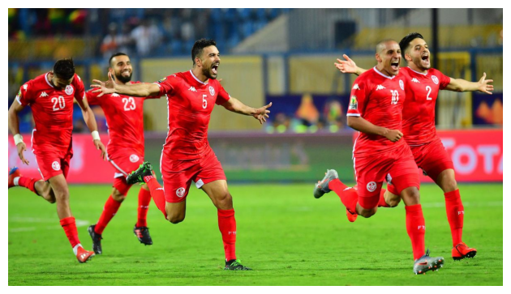
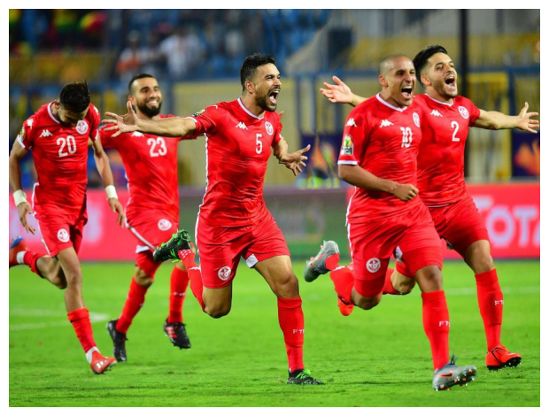

# Image Resizing

Ce projet implémente l’algorithme de **Seam Carving** pour le redimensionnement intelligent d’images dans le cadre d’un **mini-projet de théorie des graphes**.

L’image est modélisée comme un **graphe orienté acyclique (DAG)**, où chaque pixel est un nœud et chaque *seam* correspond à un **plus court chemin** du haut vers le bas de l’image.

## Méthode

L’algorithme suit quatre étapes principales :

1. **Energy Map**
2. **Modélisation en graphe (DAG)**
3. **Recherche du seam optimal**
4. **Suppression itérative des seams**

Après plusieurs centaines d’itérations, l’image est réduite significativement en largeur tout en conservant les éléments visuellement importants (visages, corps, structures principales), illustrant l’efficacité de l’approche basée sur les graphes.

Pour plus de détails sur l'implémentation, consultez :
- **[Rapport](rapport.pdf)** - Explication théorique et analyse des résultats
- **[Notebook Jupyter](image%20resizing.ipynb)** - Code interactif avec visualisations

## Résultat

### Avant : 1200 x 675 pixels

### Après suppression de 300 seams : 900 x 675 pixels

